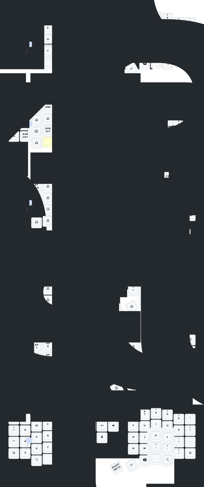

- [Chinese](README.md)
- [English](README_EN.md)

# Update List

- 2024/12/21
  1. Added support for zmk-studio (just refresh the left hand to use).
- 2024/10/24
  1. Modified power supply mode to reduce power consumption.
  2. Fixed the automatic shut-off feature for RGB power supply.
 
-2026/6/22
The keyboard now supports key remapping via DYA STUDIO. Chinese users should contact the seller to obtain the Chinese version of the DYA STUDIO installer. This PC software offers better key remapping functionality than ZMK Studio. Website: https://studio.dya.cormoran.works/ https://studio.dya.cormoran.works/

> If your keyboard was updated before October 24, please update to the latest firmware.
> 
---
# Contact Me

For 3D printed model files or any issues and malfunctions with the keyboard, please contact 380465425@qq.com

# Sofle Keymap

